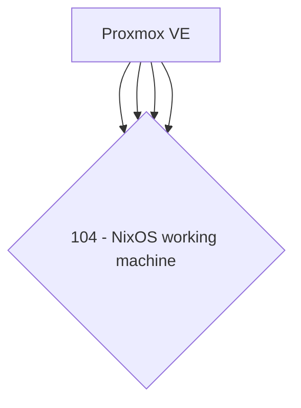

# homelab

## Resources

- https://github.com/0dragosh/homelab-k3s
- https://github.com/TUM-DSE/doctor-cluster-config/tree/master/modules/k3s
- https://github.com/fluxcd/flux2-kustomize-helm-example
