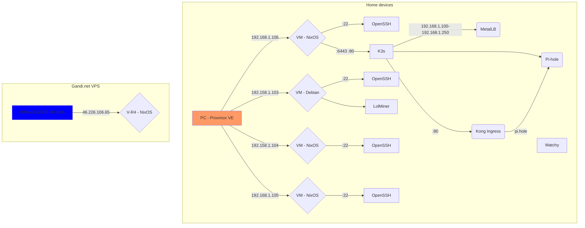

# homelab

## Overview

Diagram/flowchart using [mermaid](https://github.com/mermaid-js/mermaid)

### K3s

Running as a systemd service in a NixOS box with `traefik` and `servicelb` **disabled**.

### MetalLB

In [layer 2](https://metallb.org/concepts/layer2/) mode and ip pool of `192.168.1.100-192.168.1.250`

### LolMiner

The VM with id `102` have a Nvidia 3060 Ti GPU allocated that is being used to mine Ethereum and Ton using [lolminer](https://github.com/Lolliedieb/lolMiner-releases)

## Resources

- https://github.com/0dragosh/homelab-k3s
- https://github.com/TUM-DSE/doctor-cluster-config/tree/master/modules/k3s
- https://github.com/fluxcd/flux2-kustomize-helm-example
